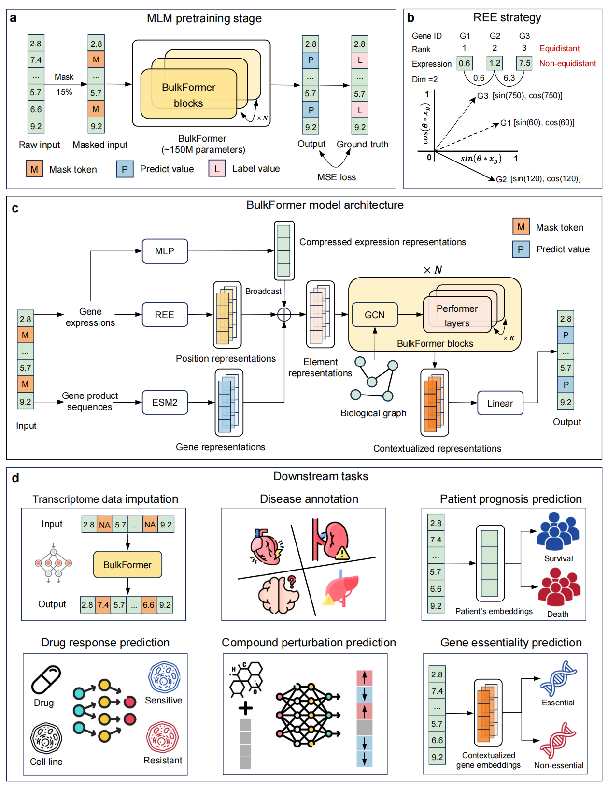

# BulkFormer
BulkFormer: A large-scale foundation model for human bulk transcriptomes


## Abstract
Large language models (LLMs) have become foundation models leading to breakthroughs in the fields of transcriptome modeling. However, existing RNA-seq foundation models are predominantly pretrained on sparse scRNA-seq data, with few designed specifically for bulk RNA-seq. Here we proposed BulkFormer, a large-scale foundation model for bulk transcriptomes, with 150 million parameters covering about 20,000 protein-coding genes, pretrained on over 500,000 human bulk transcriptomic profiles. BulkFormer features a hybrid encoder architecture combining a graph neural network to capture explicit gene-gene interactions and a performer module to model global expression dependencies. As a result, BulkFormer consistently outperforms existing baseline models in diverse downstream tasks, including transcriptome imputation, disease annotation, prognosis modeling, drug response prediction, compound perturbation simulation, and gene essentiality scoring. Notably, BulkFormer enhances the discovery of clinically relevant biomarkers and reveals latent disease mechanisms by imputing biologically meaningful gene expression. All these results show the power of BulkFormer for bulk transcriptome modeling and analysis. 

## Overview



## Results
| Task (Metric)                       | BulkFormer | Geneformer | GeneCompass | scGPT | scFoundation | scLong |
|------------------------------------|------------|------------|-------------|-------|---------------|--------|
| Expression Imputation (PCC ↑)      | **0.954**  | NA*        | NA*         | NA*   | 0.142         | 0.041  |
| Disease Annotation (Weighted F1 ↑) | **0.939**  | 0.749      | 0.882       | 0.885 | 0.874         | 0.810  |
| Tissue Annotation (Weighted F1 ↑) | **0.963**  | 0.848      | 0.919       | 0.936 | 0.939         | 0.678  |
| Cancer Subtype Annotation (Weighted F1 ↑) | **0.833**  | 0.473      | 0.761       | 0.830 | 0.791         | 0.347  |
| Prognosis Modeling (AUROC ↑)       | **0.747**  | 0.647      | 0.709       | 0.723 | 0.726         | 0.584  |
| Drug Response Prediction (PCC ↑)   | **0.910**  | 0.873      | 0.872       | 0.877 | 0.880         | 0.843  |
| Compound Perturbation (PCC ↑)      | **0.493**  | 0.473      | 0.476       | 0.481 | 0.464         | 0.471  |
| Gene Essentiality Prediction (PCC ↑)| **0.931** | 0.897      | 0.881       | 0.907 | 0.852         | 0.889  |

Note：

The best-performing values for each task are highlighted in bold.

NA*: Geneformer, GeneCompass, and scGPT were not directly pretrained to model gene expression values, and therefore cannot perform transcriptome imputation tasks. 


## Requirements
* Python 3.12.7
* PyTorch 2.5.1+ (with CUDA 12 support)
* scikit-learn 1.5+
* pandas 2.2+
* numpy 2.0+
* performer-pytorch 1.1.4+

All dependencies are managed via `pyproject.toml` and installed automatically with UV.

## Quick Start

**Step 1: Clone the repository**
```bash
git clone https://github.com/KangBoming/BulkFormer.git
cd BulkFormer
```

**Step 2: Install UV (if not already installed)**
```bash
curl -LsSf https://astral.sh/uv/install.sh | sh
```

**Step 3: Install dependencies**
```bash
uv sync
```

This will create a virtual environment in `.venv/` and install all required packages.

> **Note:** If you encounter `ImportError: 'SparseTensor' requires 'torch-sparse'`, you may need to install optional PyTorch Geometric extensions:
> ```bash
> uv pip install torch-sparse torch-scatter torch-cluster torch-spline-conv -f https://data.pyg.org/whl/torch-2.5.1+cu121.html
> ```

**Step 4: Verify installation (optional)**
```bash
uv run bulkformer verify
```

**Step 5: Download pretrained model and data**

Using the automated downloader (recommended):
```bash
# Download everything (model + data, ~7.4 GB total)
uv run bulkformer download all

# Or download separately:
uv run bulkformer download model  # Download model only (~568 MB)
uv run bulkformer download data   # Download data only (~244 MB)

# List available files
uv run bulkformer download list

# Show Zenodo record info
uv run bulkformer download info
```

Manual download:
```bash
# Visit https://doi.org/10.5281/zenodo.15559368
# Download files to model/ and data/ directories
# See model/README.md and data/README.md for details
```

**Step 6: Run model inference**
```bash
uv run jupyter notebook notebooks/bulkformer_extract_feature.ipynb
```

## Usage

### Using BulkFormer in Python

BulkFormer can extract three types of features from bulk RNA-seq data:

1. **Transcriptome-level embeddings**: Sample-level feature vectors for downstream tasks
2. **Gene-level embeddings**: Per-gene representations fused with ESM2 protein embeddings
3. **Expression imputation**: Model-predicted expression values for missing genes

#### Basic Workflow

```python
import torch
import pandas as pd
from torch_geometric.typing import SparseTensor
from bulkformer import BulkFormer, model_params

# 1. Load graph and gene embeddings
device = 'cuda'  # or 'cpu'
graph = torch.load('data/G_gtex.pt', weights_only=False)
weights = torch.load('data/G_gtex_weight.pt', weights_only=False)
graph = SparseTensor(row=graph[1], col=graph[0], value=weights).t().to(device)
gene_emb = torch.load('data/esm2_feature_concat.pt', weights_only=False)

# 2. Initialize model
model_params['graph'] = graph
model_params['gene_emb'] = gene_emb
model = BulkFormer(**model_params).to(device)

# 3. Load pretrained checkpoint
ckpt = torch.load('model/Bulkformer_ckpt_epoch_29.pt', weights_only=False)
# Remove 'module.' prefix if present
state_dict = {k.replace('module.', ''): v for k, v in ckpt.items()}
model.load_state_dict(state_dict)

# 4. Prepare your expression data (log-transformed TPM)
# Your data should be a pandas DataFrame with samples as rows and genes as columns
expr_df = pd.read_csv('your_data.csv')

# 5. Align to BulkFormer gene list (handles missing genes)
gene_info = pd.read_csv('data/bulkformer_gene_info.csv')
gene_list = gene_info['ensg_id'].to_list()
# ... alignment code (see notebook for details)

# 6. Extract features
# See notebooks/bulkformer_extract_feature.ipynb for complete examples
```

#### Data Preparation Tips

- **Input format**: Log-transformed TPM values (normalized expression)
- **Gene identifiers**: Ensembl Gene IDs (ENSG)
- **Missing genes**: Automatically handled with placeholder imputation
- **Count normalization**: Use the provided `normalize_data()` function for raw counts

### Running Python Scripts

There are two ways to run your Python scripts:

```bash
# Option 1: Use uv run (recommended)
uv run python your_analysis.py

# Option 2: Activate virtual environment first
source .venv/bin/activate
python your_analysis.py
```

### CLI Tools

BulkFormer provides command-line tools for setup, verification, and feature extraction:

```bash
# Verify installation and check dependencies
uv run bulkformer verify

# Download model and data files
uv run bulkformer download all      # Download everything
uv run bulkformer download model    # Model only
uv run bulkformer download data     # Data only
uv run bulkformer download list     # List available files
uv run bulkformer download info     # Show Zenodo record info

# Extract features from expression data (NEW!)
uv run bulkformer extract input.csv output.pt                    # Transcriptome-level embeddings
uv run bulkformer extract input.csv output.pt --counts           # Normalize raw counts first
uv run bulkformer extract input.csv output.pt --type gene_level  # Gene-level embeddings
uv run bulkformer extract input.csv output.csv --type expression_imputation  # Impute expression

# Get help
uv run bulkformer --help
uv run bulkformer download --help
uv run bulkformer extract --help
```

#### Feature Extraction CLI Options

The `bulkformer extract` command provides a simple way to process your expression data:

```bash
uv run bulkformer extract INPUT_FILE OUTPUT_FILE [OPTIONS]
```

**Arguments:**
- `INPUT_FILE`: CSV file with samples as rows and genes (Ensembl IDs) as columns
- `OUTPUT_FILE`: Where to save extracted features (.pt for tensors, .csv for expression)

**Options:**
- `--type`, `-t`: Feature type (default: `transcriptome_level`)
  - `transcriptome_level`: Sample-level embeddings for downstream ML tasks
  - `gene_level`: Per-gene embeddings fused with ESM2 protein embeddings
  - `expression_imputation`: Predict expression values for missing genes
- `--aggregate`, `-a`: Aggregation method for transcriptome-level (default: `max`)
  - `max`, `mean`, `median`, or `all` (combines all three)
- `--counts`, `-c`: Input is raw count data (will normalize to log-TPM)
- `--batch-size`, `-b`: Batch size for inference (default: 16)
- `--device`, `-d`: Device to use: `cuda` or `cpu` (default: `cuda`)
- `--model-dir`: Directory containing model checkpoint (default: `model`)
- `--data-dir`: Directory containing data files (default: `data`)

**Examples:**

```bash
# Basic usage: extract transcriptome-level features from normalized data
uv run bulkformer extract my_expression.csv features.pt

# Process raw count data (will normalize automatically)
uv run bulkformer extract raw_counts.csv features.pt --counts

# Extract gene-level embeddings with mean aggregation
uv run bulkformer extract my_data.csv gene_features.pt --type gene_level --aggregate mean

# Impute missing gene expression and save as CSV
uv run bulkformer extract partial_data.csv imputed.csv --type expression_imputation

# Use CPU instead of GPU
uv run bulkformer extract my_data.csv features.pt --device cpu
```

### Example Notebook

For a complete, runnable example, see:
```bash
uv run jupyter notebook notebooks/bulkformer_extract_feature.ipynb
```

This notebook demonstrates:
- Loading and initializing the model
- Normalizing raw count data
- Aligning genes to the BulkFormer gene space
- Extracting transcriptome-level and gene-level features
- Expression imputation for missing genes

## Managing Dependencies

```bash
uv add package-name      # Add a package
uv remove package-name   # Remove a package
uv sync                  # Update dependencies
```

## Publication
A large-scale foundation model for human bulk transcriptomes

## License
This project is licensed under the MIT License - see the [LICENSE.txt](https://github.com/KangBoming/DeepAVC/blob/main/LICENSE) file for details

## Contact
Please feel free to contact us for any further queations

Boming Kang <kangbm@bjmu.edu.cn>

Qinghua Cui <cuiqinghua@bjmu.edu.cn>


