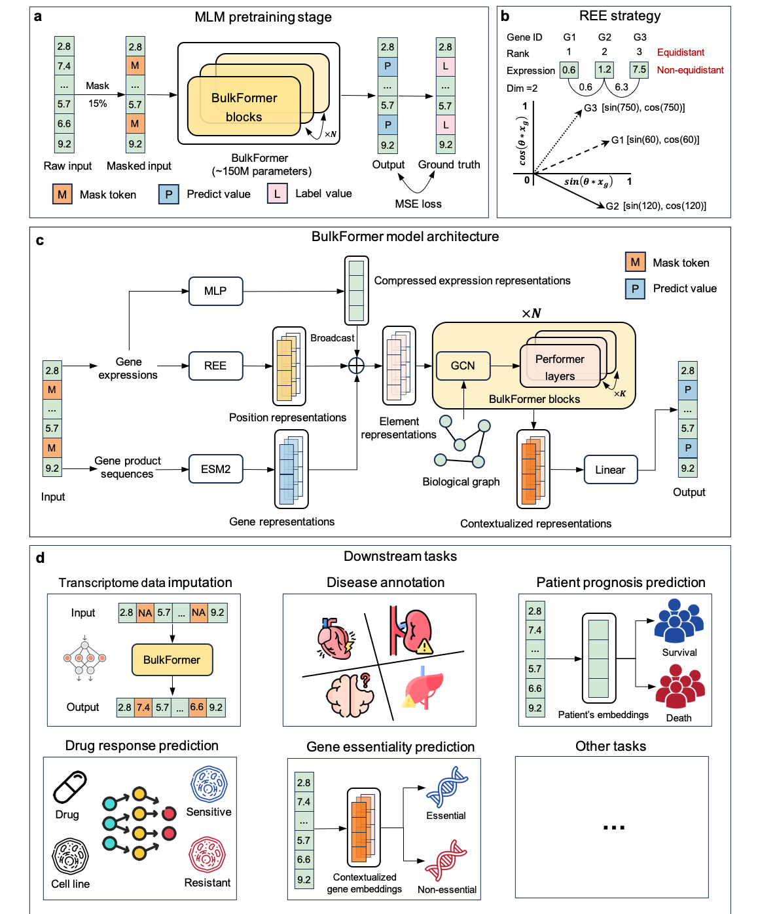
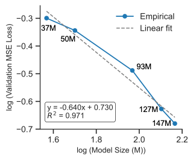

# BulkFormer: A Large-Scale Foundation Model for Human Bulk Transcriptomes


##  What’s New (Last Updated: 2025-12-11)

**All previous code files, data files and  pretrained model weights have also been comprehensively updated—please refer to the latest release for the correct and up-to-date version of BulkFormer.**


### 🔹 1. Removed compound perturbation prediction task  
After careful reconsideration, we decided to **remove the compound perturbation prediction benchmark** from the BulkFormer evaluation suite. In the original version, we directly applied BulkFormer to extract features from the **LINCS** perturbation dataset. However, the LINCS transcriptional profiles are **not generated by bulk RNA-seq**, but by a distinct assay platform with a different measurement modality and gene coverage. This creates a substantial **modality mismatch** between BulkFormer’s pretraining data (bulk RNA-seq) and the perturbation data, making the previous evaluation setting conceptually inconsistent. To avoid misleading usage and over-interpretation, we have therefore removed this task from the main benchmark table and current release.

### 🔹 2. Updated model feature extraction utilities  
The file `bulkformer_extract_feature.py` has been streamlined and improved:
- Added support for **ESM2 fusion** at the gene-level feature stage  
- Improved **GPU memory efficiency** for large-cohort inference  

### 🔹 3. Updated model architecture implementation  
For each input sample, we now compute and feed three explicit **global summary features** into the model:  
  - **Gene missing rate** (proportion of genes absent relative to the pretrained vocabulary)  
  - **Mean gene expression level**  
  - **Proportion of non-zero genes**  
These summary statistics help BulkFormer better model heterogeneous bulk RNA-seq samples, especially when gene coverage or sparsity varies across datasets.


---


## 📘 Abstract
Large language models have emerged as powerful foundation models that are transforming transcriptome analysis. However, existing RNA-seq foundation models are all pretrained on sparse scRNA-seq data, which typically detects only ~3000 genes per cell. This thus creates a critical gap in models (especially clinical models) specifically designed for bulk transcriptomes, a fundamentally different modality capable of profiling ~16,000 genes per sample. Here we propose BulkFormer, a large-scale foundation model for bulk transcriptome analysis. With ~150 million parameters covering about 20,000 protein-coding genes, BulkFormer is pretrained on over 500,000 human bulk RNA-seq profiles. BulkFormer incorporates a hybrid encoder architecture, combining a graph neural network to capture explicit gene-gene interactions and a performer module to model global expression dependencies. As a result, despite incurring substantially lower training costs than single-cell foundation models, BulkFormer consistently outperforms them in five downstream tasks: transcriptome imputation, disease annotation, prognosis modeling, drug response prediction, and gene essentiality prediction. Moreover, through a series of experiments, we demonstrate that the modality of the pretraining data exerts a critical influence on foundation model performance. Collectively, these results demonstrate BulkFormer’s power as a versatile and robust framework for bulk transcriptome modeling and biomedical discovery.

---

## 🧬 Overview



---

## 📊 Results
| Task (Metric)                                   | BulkFormer | Geneformer | GeneCompass | scGPT | scFoundation | scLong | State | Cell2Sentence |
|-------------------------------------------------|-----------:|-----------:|------------:|------:|-------------:|-------:|------:|--------------:|
| Bulk RNA-seq Data Imputation (PCC ↑)            | **0.954**  | NA* | NA*         | NA*   | 0.142        | 0.041  | NA*   | NA*           |
| DiSignAtlas classification (weighted F1 ↑)      | **0.949**  | 0.749| 0.882       | 0.885 | 0.874        | 0.810  | 0.909 | 0.890         |
| CVD classification (weighted F1 ↑)              | **0.978**  | 0.884 | 0.937       | 0.953 | 0.955        | 0.892  | 0.944 | 0.943         |
| TCGA classification (weighted F1 ↑)             | **0.907**  | 0.528      | 0.774       | 0.813 | 0.791        | 0.514  | 0.851 | 0.770         |
| GETX classification (weighted F1 ↑)             | **0.969**  | 0.848      | 0.919       | 0.936 | 0.939        | 0.678  | 0.926 | 0.940         |
| Drug Response Prediction (mean PCC ↑)           | **0.373**  | 0.246      | 0.300       | 0.356 | 0.303        | 0.238  | 0.336 | 0.328         |
| Gene Essentiality Prediction (mean PCC ↑)       | **0.186**  | 0.104      | 0.123       | 0.143 | 0.155        | 0.111  | 0.137 | 0.118         |

**Note**  
1. The best-performing values for each task are highlighted in bold.  
2. NA*: Geneformer, GeneCompass, scGPT, State and Cell2Sentence were not directly pretrained to model gene expression values, and therefore cannot perform transcriptome imputation tasks.

---


## 🏋️ BulkFormer Model Variants

We trained and released **five BulkFormer models** at different parameter scales to support diverse research and deployment scenarios.

| Model Name          | Parameters | Hidden Dim | Layers | Heads | Download   |
|---------------------|-----------:|-----------:|-------:|------:|-----------:|
| **BulkFormer-37M**  | 37M        | 128        | 1      | 8     | [Download](#) |
| **BulkFormer-50M**  | 50M        | 256        | 2      | 8     | [Download](#) |
| **BulkFormer-93M**  | 93M        | 512        | 6      | 8     | [Download](#) |
| **BulkFormer-127M** | 127M       | 640        | 8      | 8     | [Download](#) |
| **BulkFormer-147M** | 147M       | 640        | 12     | 8     | [Download](#) |




*Figure: Scaling law fitting curve across BulkFormer model scales.*


## 📦 Main requirements
* python=3.12.7
* pytorch=2.5.1
* scikit-learn=1.5.2
* pandas=2.2.3
* numpy=2.0.2
* performer-pytorch=1.1.4

## 🚀 Quick start
**Step1: clone the repo**
```
mkdir ./BulkFormer
cd BulkFormer
git clone https://github.com/KangBoming/BulkFormer.git
```
**Step2: create and activate the environment**
```
cd BulkFormer
conda env create -f bulkformer.yaml
conda activate bulkformer
```
**Step3: download pretrained model and data**
```
cd BulkFormer/model
Please follow the README.md file to download pretrained BulkFormer model.

cd BulkFormer/data
Please follow the README.md file to download related data.
```

**Step4: model infernece**
```
cd BulkFormer
Please follow bulkformer_extract_feature.ipynb
```

## 📄 Publication
A large-scale foundation model for human bulk transcriptomes

## 📜 License
This project is licensed under the MIT License - see the [LICENSE.txt](https://github.com/KangBoming/DeepAVC/blob/main/LICENSE) file for details

## 📫 Contact
Please feel free to contact us for any further questions

Boming Kang <kangbm@bjmu.edu.cn>

Qinghua Cui <cuiqinghua@bjmu.edu.cn>


