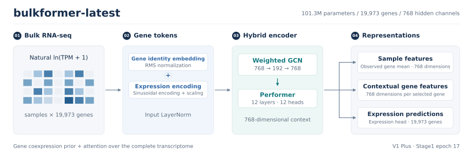

<h1 align="center">BulkFormer</h1>

<p align="center">
  <strong>A large-scale foundation model for bulk transcriptomes</strong>
</p>

<p align="center">
  Boming Kang · Rui Fan · Meizheng Yi · Chunmei Cui · Qinghua Cui<br>
  <em>Cell Systems, 2026</em>
</p>

<p align="center">
  <a href="https://doi.org/10.1016/j.cels.2026.101657"></a>
  <a href="docs/models/bulkformer-latest.md"></a>
  <a href="configs/bulkformer-latest.yaml"></a>
  <a href="LICENSE"></a>
</p>

<p align="center">
  <a href="https://doi.org/10.1016/j.cels.2026.101657">Paper</a> ·
  <a href="#models-and-downloads">Models</a> ·
  <a href="notebooks/bulkformer-latest_feature_extraction.ipynb">Notebook</a> ·
  <a href="#performance">Performance</a> ·
  <a href="#quick-start">Quick start</a> ·
  <a href="docs/README.md">Documentation</a>
</p>

---

BulkFormer is a family of pretrained foundation models for **human bulk RNA-seq**. It combines gene coexpression graphs with Performer attention to learn representations across the complete transcriptome, supporting sample analysis, contextual gene representations, and expression reconstruction.

## News

> [!NOTE]
> **2026-10-09 — We release `bulkformer-latest`.**
>
> Our new public model has **101.3M parameters**, covers **19,973 human genes**, and produces **768-dimensional representations** with a weighted GCN and 12-layer Performer encoder. It provides sample embeddings, contextual gene embeddings, and expression predictions. The released weights correspond to **V1 Plus Stage1 epoch 17**.

**[Model card](docs/models/bulkformer-latest.md)** · **[Complete weights](https://drive.google.com/file/d/1ly4CNE6XHqHKSP1a5c0UGUeaSVC0Was1/view?usp=drivesdk)** · **[Configuration & resources](https://drive.google.com/drive/folders/1AfekiOBNs6GzPBbA9BDlpuoolZIWbGQ2)** · **[Usage notebook](notebooks/bulkformer-latest_feature_extraction.ipynb)**

See the [changelog](CHANGELOG.md) for the release history.

## Overview



<p align="center"><sub>Architecture of <strong>bulkformer-latest</strong>. The full gene axis is processed for every sample; the three outputs support complementary downstream analyses.</sub></p>

- **Complete transcriptome context.** A weighted coexpression graph captures gene relationships, while Performer attention models dependencies across the full gene vocabulary.
- **Three representation levels.** Extract one vector per sample, contextual vectors for selected genes, or expression predictions for all 19,973 genes.
- **Explicit input conventions.** Missing genes and measured zeros are handled separately. Sample pooling includes observed genes, including measured zeros.

Architecture, pretraining, and checkpoint details are described in the [model card](docs/models/bulkformer-latest.md). The [original model overview](docs/models/original-models.md) documents the 37M–147M family.

## Performance

### bulkformer-latest vs bulkformer-147M

The released checkpoint improves frozen-feature classification across all three evaluated phenotype tasks. Scores are **pooled out-of-fold weighted F1**, using the same samples, registered 10-fold assignments, and fixed cuML random forest settings.

| Task | bulkformer-147M | bulkformer-latest | Gain |
|---|---:|---:|---:|
| Disease / state · DiSignAtlas | 0.9148 | **0.9293** | **+1.45 pp** |
| Cancer type · TCGA | 0.8813 | **0.9173** | **+3.60 pp** |
| Tissue · GTEx | 0.8607 | **0.9114** | **+5.07 pp** |

Gains are absolute percentage points calculated from unrounded scores. The latest model has approximately **31% fewer parameters** than the nominal 147M model.

The comparison uses each model's native vocabulary, feature dimension, and extraction precision; GTEx folds are grouped by donor. Source collections can overlap pretraining sources. Full settings and aggregate results are available in the [benchmark record](benchmarks/phenotype/README.md).

<details>
<summary><strong>Evaluation cohorts and reported scores</strong></summary>

| Dataset | Samples | Classes | Split |
|---|---:|---:|---|
| DiSignAtlas | 10,688 | 19 | Stratified 10-fold |
| TCGA | 9,780 | 33 | Stratified 10-fold |
| GTEx | 19,616 | 54 | Donor-grouped stratified 10-fold |

Encoders are frozen. The classifier uses 500 trees, maximum depth 16, `max_features="sqrt"`, `min_samples_leaf=2`, and seed 42. The registered 147M results are reused under the matched downstream protocol. Latest extraction uses BF16 and 768-dimensional features; 147M extraction uses FP16 and 643-dimensional features.

- [Full precision scores](benchmarks/phenotype/metrics.csv)
- [Aggregate fold results](benchmarks/phenotype/per_fold.csv)
- [Protocol and checkpoint identities](benchmarks/phenotype/protocol.json)
- [Original publication benchmark table](docs/benchmarks/paper-results.md)

The original publication table uses a separate evaluation protocol. These records describe the retained phenotype evaluations; the demonstration notebook uses synthetic counts.

</details>

## Models and downloads

| Model | Parameters | Hidden dim | Layers | Weights | Guide |
|---|---:|---:|---:|---|---|
| **bulkformer-latest** | **101.3M** | **768** | **12** | [Google Drive](https://drive.google.com/file/d/1ly4CNE6XHqHKSP1a5c0UGUeaSVC0Was1/view?usp=drivesdk) | [Model card](docs/models/bulkformer-latest.md) |
| bulkformer-147M | 147M | 640 | 12 | [Google Drive](https://drive.google.com/file/d/1UtqN_vCh3669Fs-GU5CTE7F7UnuQCAzN/view?usp=drive_link) | [Original models](docs/models/original-models.md) |
| bulkformer-127M | 127M | 640 | 8 | [Google Drive](https://drive.google.com/file/d/1-5AdgIpkm8dOm9tuwOXcqS1sUyGN6vHg/view?usp=drive_link) | [Original models](docs/models/original-models.md) |
| bulkformer-93M | 93M | 512 | 6 | [Google Drive](https://drive.google.com/file/d/1s_3XoMaHiBfxi5C8D3bgwwzNrihafaIk/view?usp=drive_link) | [Original models](docs/models/original-models.md) |
| bulkformer-50M | 50M | 256 | 2 | [Google Drive](https://drive.google.com/file/d/12ZYGYrZIQJyodaVicrJpnY_8_JG-hamK/view?usp=drive_link) | [Original models](docs/models/original-models.md) |
| bulkformer-37M | 37M | 128 | 1 | [Google Drive](https://drive.google.com/file/d/1qY2qaXfKfDot9EMcOF9gr8T0jghrH7km/view?usp=drive_link) | [Original models](docs/models/original-models.md) |

The latest weights are distributed as **one complete `model.pt` file (406 MB)**. Its configuration, vocabulary, gene lengths, graph, and checksum manifest are available in the [same Google Drive folder](https://drive.google.com/drive/folders/1AfekiOBNs6GzPBbA9BDlpuoolZIWbGQ2). Each model family uses its matching resources and loader; see [download instructions](model/README.md).

## Quick start

### 1. Set up the environment

```bash
git clone https://github.com/KangBoming/BulkFormer.git
cd BulkFormer
conda env create -f configs/bulkformer-latest.yaml
conda activate bulkformer-latest
```

### 2. Download the latest model

Save `model.pt` and its five accompanying resource files from the [model folder](https://drive.google.com/drive/folders/1AfekiOBNs6GzPBbA9BDlpuoolZIWbGQ2) into `model/bulkformer-latest/`. The preparation step verifies all six files against the published [SHA256 manifest](model/downloads/bulkformer-latest.json).

<details>
<summary>Required model files</summary>

```text
model/bulkformer-latest/
├── model.pt
├── model_config.json
├── gene_vocab.csv
├── edge_index.pt
├── edge_weight.pt
└── manifest.json
```

If Drive wraps a folder download in a ZIP, extract it first so these files are directly inside the model directory.

</details>

### 3. Run the GPU notebook

```bash
CUDA_VISIBLE_DEVICES=0 jupyter lab notebooks/bulkformer-latest_feature_extraction.ipynb
```

The notebook demonstrates sample, gene, and expression outputs on four synthetic count profiles. Start with **batch size 1**; the notebook selects a supported precision for your GPU. Inputs use samples × Ensembl gene IDs; raw counts are converted to natural `ln(TPM+1)` with the released gene lengths.

<details>
<summary><strong>Minimal Python example</strong></summary>

Run from the repository root after downloading the model files:

```python
import pandas as pd
from utils.latest import (
    prepare_latest_bundle, load_latest_model,
    normalize_data, main_gene_selection, extract_feature,
)

model_dir = prepare_latest_bundle("model/bulkformer-latest")
model, vocab, metadata = load_latest_model(model_dir, device="cuda")

counts = pd.read_csv("data/latest_demo_counts.csv", index_col=0)
expression = normalize_data(counts, vocab)
aligned, _, _ = main_gene_selection(expression, vocab["canonical_ensg"])
sample_features = extract_feature(model, aligned.to_numpy(), batch_size=1)
```

For normalized expression, missing values, precision options, and other output types, see the [usage guide](docs/usage.md).

</details>

The original 37M–147M models use their [original notebook](bulkformer_extract_feature.ipynb) and [environment](bulkformer.yaml), as described in the [original-model guide](docs/models/original-models.md).

## Documentation

| Resource | Contents |
|---|---|
| [Latest model card](docs/models/bulkformer-latest.md) | Architecture, pretraining, checkpoint identity, and input / output conventions |
| [Usage guide](docs/usage.md) | Installation, GPU inference, data preparation, and feature extraction |
| [Phenotype benchmark](benchmarks/phenotype/README.md) | Latest vs 147M results, folds, classifier settings, and provenance |
| [Original models](docs/models/original-models.md) | The original model family and publication figures |
| [Documentation index](docs/README.md) | Complete guides and repository navigation |
| [Changelog](CHANGELOG.md) | Release history and updates |

<details>
<summary>Repository structure</summary>

```text
BulkFormer/
├── configs/             Environment configurations
├── notebooks/           Feature extraction examples
├── docs/                Model cards, guides, and figures
├── benchmarks/          Aggregate results and evaluation protocols
├── model/               Download manifests, validation, local weights
├── data/                Synthetic example and original gene resources
├── utils/latest/        Latest model and inference API
├── utils/v1plus/        Earlier-name compatibility imports
└── tests/               Input, pooling, and download integrity checks
```

</details>

## Publication

If you use BulkFormer in your research, please cite:

**Boming Kang, Rui Fan, Meizheng Yi, Chunmei Cui, and Qinghua Cui.**<br>
*BulkFormer: A large-scale foundation model for bulk transcriptomes.*<br>
**Cell Systems**, 101657 (2026). [DOI: 10.1016/j.cels.2026.101657](https://doi.org/10.1016/j.cels.2026.101657).

```bibtex
@article{kang2026bulkformer,
  title = {BulkFormer: A large-scale foundation model for bulk transcriptomes},
  author = {Kang, Boming and Fan, Rui and Yi, Meizheng and Cui, Chunmei and Cui, Qinghua},
  journal = {Cell Systems},
  year = {2026},
  pages = {101657},
  doi = {10.1016/j.cels.2026.101657}
}
```

For results obtained with `bulkformer-latest`, also report its checkpoint ID from the [model card](docs/models/bulkformer-latest.md).

## License and contact

Code is released under the [MIT License](LICENSE).

**Boming Kang:** [kangbm@bjmu.edu.cn](mailto:kangbm@bjmu.edu.cn) · **Qinghua Cui:** [cuiqinghua@bjmu.edu.cn](mailto:cuiqinghua@bjmu.edu.cn)
