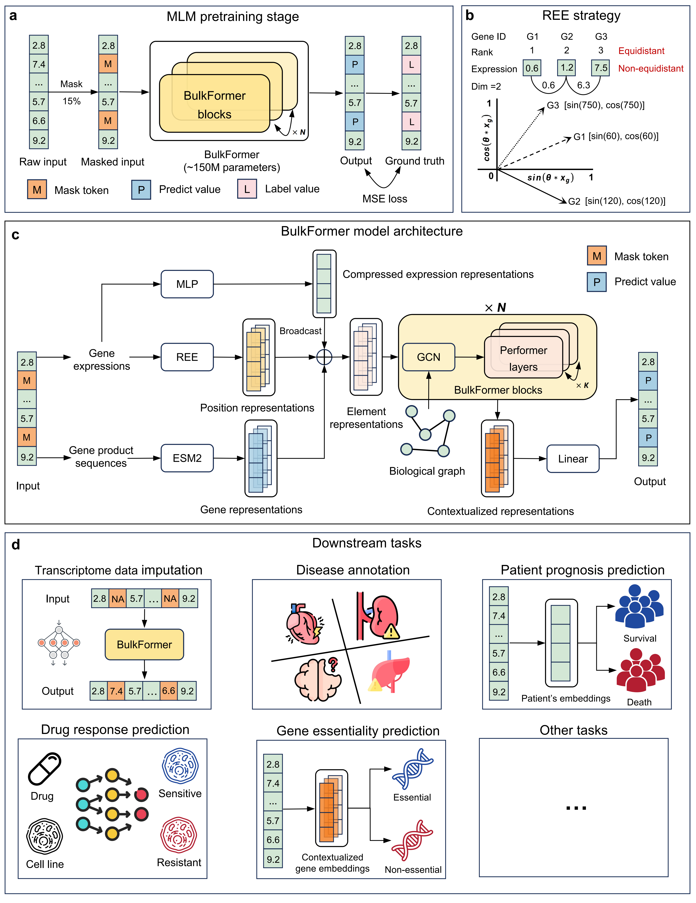
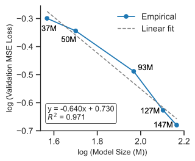

# Original BulkFormer models

The original model family contains five scales: 37M, 50M, 93M, 127M, and 147M. Weight links are listed in the [model download directory](../../model/README.md).

## Architecture and resources

The 147M model uses 20,010 gene tokens, 640 hidden channels, and 12 Performer layers with 8 heads. A full-transcriptome MLP projects 20,010 → 2,560 → 640 and adds the resulting sample context to every gene token. Its returned contextual representation contains 640 encoder channels plus three summary-statistic channels. Optional ESM2 fusion is provided by the original feature extraction workflow.



The overview describes the original model family. The [bulkformer-latest model card](bulkformer-latest.md) describes the newer architecture and its own resource bundle.

## Original inference workflow

From the repository root:

```bash
conda env create -f bulkformer.yaml
conda activate bulkformer
```

1. Download the chosen model checkpoint using [model/README.md](../../model/README.md). For the 147M notebook, save it as `model/bulkformer_147M.pt`.
2. Download the graph and example resources using [data/README.md](../../data/README.md). The original notebook uses `data/G_tcga.pt`, `data/G_tcga_weight.pt`, and `data/esm2_feature_concat.pt`, plus the original vocabulary and gene lengths. Supply the demonstration CSVs shown in the notebook or replace them with your own data.
3. Set the matching scale in `model/config.py`, then run [bulkformer_extract_feature.ipynb](../../bulkformer_extract_feature.ipynb) from the repository root. The default configuration selects 147M.

The original environment and notebook retain their established layout. For `bulkformer-latest`, use [configs/bulkformer-latest.yaml](../../configs/bulkformer-latest.yaml) and its [dedicated notebook](../../notebooks/bulkformer-latest_feature_extraction.ipynb).

## Reported results and scale study

- [Original paper benchmark table](../benchmarks/paper-results.md)
- [Matched latest vs 147M phenotype evaluation](../../benchmarks/phenotype/README.md)



The scale study belongs to the original five-model family; `bulkformer-latest` is a separate architecture release.
